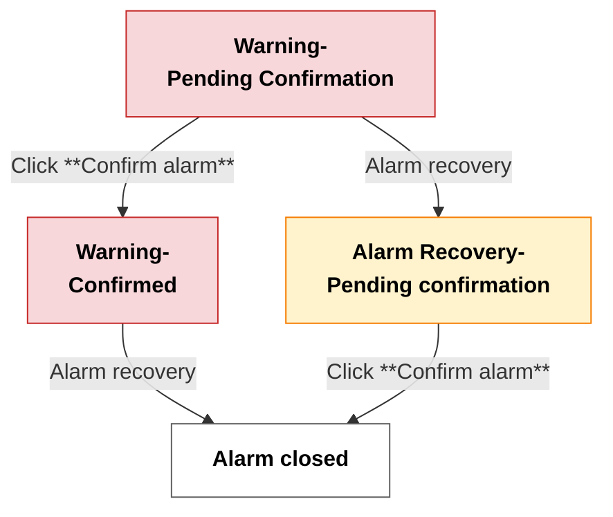

# Configure Point Alarms

In device management for smart home systems, Aqara Studio lets you flexibly configure and customize alarm rules for each function point. This ensures real-time monitoring of abnormal states and a fast response. This article explains how to set up different types of alarms, trigger conditions, and alarm messages for various types of data points. This will help you protect device safety and keep your system stable.

## Alarm Configuration Steps

1. Go to the **Devices** page. In the device tree on the left, find the function point folder you want to view.
2. Double-click this folder to switch to the function point's **Essential** tab.
3. Find the **Alarm config** section and click the **+** button.
4. In the popup, set the following parameters:

    | Parameter         | Description                                                                                      |
    |------------------|--------------------------------------------------------------------------------------------------|
    | Source Name      | The custom name of the alarm.                                                                    |
    | Alarm Value      | The value that triggers the alarm. For boolean function points, this is a single-choice parameter. For enum function points, you can select multiple values.  |
    | Alarm Class       | Alarm level. Options include Normal, Urgent, Important, or you can set a custom type.            |
    | Delay Time       | The system will only send an alarm to the user if the function point stays abnormal for this period. This helps to avoid false alarms caused by short fluctuations.  |
    | Normal Delay Time| After the function point leaves the alarm state, it must stay normal for this period to be considered recovered. This prevents frequent reminders due to temporary changes. |
    | To Off Normal Text | The message shown to the user when the alarm is triggered.                                        |
    | To Normal Text | The message shown to the user after recovery.                                                     |

    The diagram below illustrates the effect of delay time, normal delay time, user confirmation of alarms, and the status of alarm rule activation on the overall alarm timeline:

    

    For numeric function points, there are also these parameters:

    | Parameter         | Description                                                                 |
    |-------------------|-----------------------------------------------------------------------------|
    | Limit Enabled     | Choose to enable the lower limit, upper limit, or both.                      |
    | Low Limit       | The lowest allowed normal value. When the device reading drops below the low limit, the alarm state changes to abnormal (LOW_LIMIT).                                            |
    | High Limit      | The highest allowed normal value. When the device reading exceeds the high limit, the alarm state changes to abnormal (HIGH_LIMIT).                                           |
    | Deadband        | It is used to prevent frequent state switching due to small fluctuations near the threshold. <ul><li>When the low limit is enabled: Once the reading drops to the low limit and becomes abnormal, the state will only return to normal when the reading rises above the lower limit plus the deadband.</li><li>When the high limit is enabled: Once the reading rises to the high limit and becomes abnormal, the state will only return to normal when the reading drops below the high limit minus the deadband.</li></ul> |

    The diagram below shows how the alarm state responds as the device reading crosses the low and high limits, as well as when it returns to the recovery points (low limit + deadban, and high limit - deadband).

    

    After setting the parameters, click Confirm. You will see a new card in the **Alarm config** section.
5. Toggle the switch on the card to enable the alarm configuration.
6. After the alarm config is enabled, once the function point value meets the configured alarm rule, the alarm configuration card will automatically display the alarm prompt, status, occurrence time, and an acknowledge button. You can click the acknowledge button to quickly confirm the alarm.
    :::tip
    You can also visit the [Alarms](./../alarm-management.mdx) to view detailed alarm information, such as alarm data, recovery time, acknowledgment time, and more.
    :::

## Alarm Lifecycle

In the **Alarm Config** section of the function point configuration page, you can view the current status of alarms in real time via the alarm config card and clearly track which stage of the alarm lifecycle it is in.

The alarm lifecycle is divided into four stages: "Warning-Pending Confirmation", "Warning-Confirmed", "Alarm Recovery-Pending confirmation", and "Alarm closed". Transitions between these stages depend both on whether the alarm has recovered to normal and on whether the user has confirmed it. The whole process is illustrated below:

Stage explanations:

- **Warning-Pending Confirmation**: A new alarm is generated, and the user has not yet confirmed it, indicating that the alarm requires attention and handling.
- **Warning-Confirmed**: The alarm still exists, but the user is aware of it, indicating that the alarm is being dealt with.
- **Alarm Recovery-Pending confirmation**: The alarm has recovered to normal, but the user has not confirmed it yet. This means the event will only be fully closed after user confirmation.
- **Alarm closed**: The alarm has recovered to normal and also been confirmed by the user. The alarm is now closed.

## FAQ

### Why does Aqara Studio still send alarm reminders after I have acknowledged the alarm?

If the function point value has not changed and still matches the alarm condition, Aqara Studio will keep reminding you about the alarm even if you acknowledge it manually. Only when the value returns to normal will the system stop sending alarm reminders.